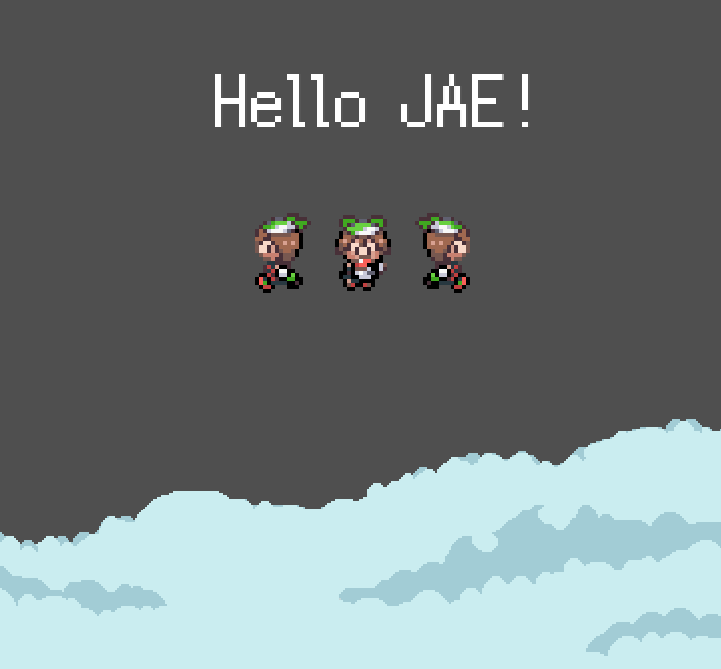

# Just Another Engine

## Currently In Active Development
  - Non-production beta builds released frequently

## How-to-Build
  This project utilizes Makefile (change to CMake later)
  To build a fresh project, please follow the following:
  1. `mkdir build && cd build`
  2. `cd .. && make`
  3. Put all /x64/ dlls into the build folder (excluding optional)
  
  **required**: all dependencies not labled optional put into deps.
  

`Dependencies:`
  - SDL2 2.0.16+ (soon 2.0.18)
  - SDL_Mixer 2.0.4
  - SDL_TTF 2.0.15
  - SDL_Image 2.0.5
  - TMXLite (optional)

`Features to be added:`
  - [ ] Entity Component System
  - [ ] Scripting ([WREN](https://www.wren.io))
  - [ ] Verbose Logging
  - [ ] C/C++ Single Header
  - [ ] Multiple gamepad support
  - [ ] Keybinding 
  - [ ] ImGui
  - [ ] Emscripten
  - [ ] Collider types (box & circle)
  - [ ] A smile on your face

`Examples to be added:`
  - [ ] Window launching
  - [ ] Entity (loading, animations, interaction)
  - [ ] Shapes (triangles, rectangles, circles, polygons)
  - [ ] GUI 
  - [ ] Input 
  - [ ] Additional Events
  - [ ] Audio (loading, playing, altering (audio data & volume) 
  - [ ] Animations
  - [ ] Map (loading & animations)
  - [ ] Hinode (A game being built on top of JAE)
